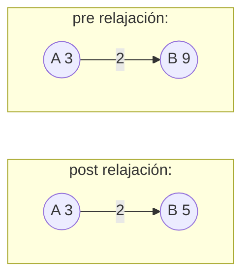
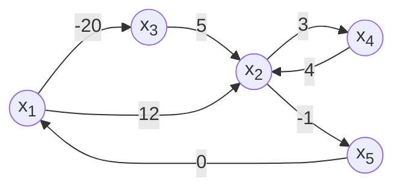
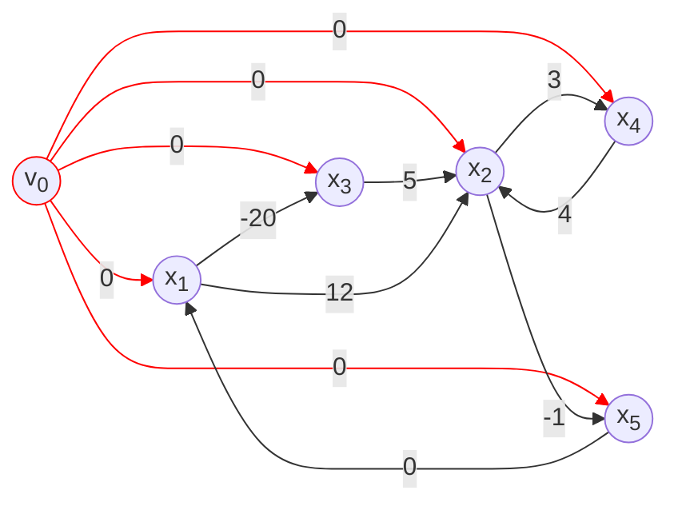
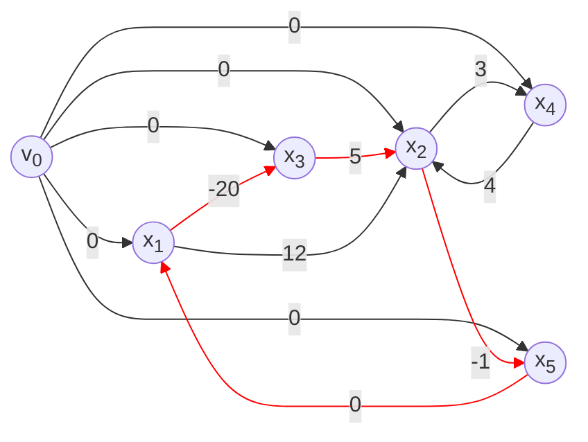
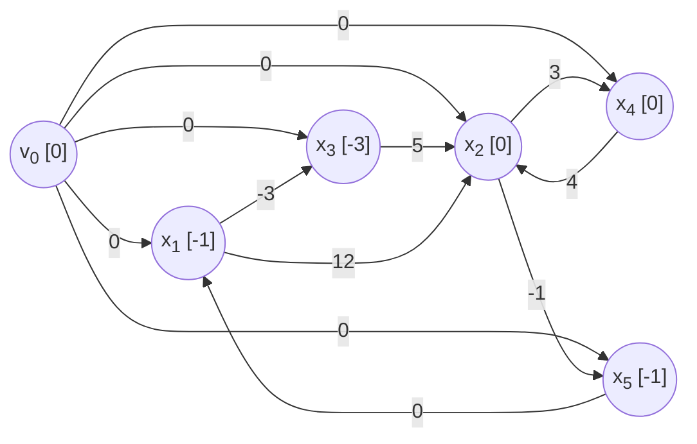

# Clase 7 Caminos minimos

NO PARA GENTE QUE DICE QUE TrOLLFACE ES CRINGE :trolleybus: 

Costo: $$ Costo(t) = \sum_{e \in E} w(e)$$

## Topologias de problemas de camino mínimo:

1. Uno a uno (Incluido en BFS, no existen mejores soluciones en complejitud para uno a uno)
2. Uno a muchos (BFS para no pesado)
3. Muchos a Muchos

### Relajación

$$ d(u,v) $$ distancia estimada entre u y v, $$\delta(u, v,)$$ distancia minima real entre u y v.

```
RELAX( u, v, w):
	if(v.d > u.d + w(u,v)):
		v.d = u.d + w(u,v)
		v.pred = u
```

**Propiedades de la relajación**:

- **Desigualdad triangular:** Para toda arista $$ (u,v) \in E$$, tenemos que $$ \delta(s,v) \leq \delta(s,u) + w(u,v) $$
- **Cota superior:** La distancia real es menor o igual a la estimada(.d) $$ v.d \geq \delta(s,v)$$ para todo vertice, y cuando $$ v.d == \delta(s,v) $$ no vuelve a cambiar
- **No hay camino:** Si no hay camino entre s y v entonces $$ v.d == \delta(s,v) == \infin $$
- **Convergencia:** Si $s \rarr ... \rarr u \rarr v$ es un camino minimo en G para algun $u,v \in V$, y si $u.d = \delta(s, u)$ en algun momento antes de relajar el edge (u,v); entonces despues de relajar el edge $v.d = \delta(s,v)$ para siempre.
- **Relajación de camino mínimo:** si $p = \langle s=v_0,v_1, ..., v_k \rangle$ es un camino minimo desde $s$ a $v_k$ y relajamos los edges de p en orden, entonces despues de todos las relajaciones $v_k.d = \delta(s,v_k)$. Esto pasa incluso si hay relajaciones en el medio que afecten a los nodos en p.
- **Subgrafo de predecesores:** una vez que $v.d = \delta(s,v) \ \forall \ v \in V$ el subgrafo predecesor es un árbol de caminos mínimos enraizados en s.



### Inicialización para el proceso de Relajación:

```
INIT (Graph(G), source(s)):
	for each vertex v in G.V:
		v.d = inf
		v.parent = NIL
	s.d = 0
```


### Shortest path in directed acyclic graphs:

```
DAG (Graph, source):
	TOPOLOGICAL-SORT(G)
	INIT(G,s)
	for u in V (en el orden de TOPO-SORT):
		for v in Adj[u]
			RELAX(u,v)
```

### Dijkstra:

Solo sirve si no hay aristas con pesos no negativos

```
DIJKSTRA(G, w, s)
	INIT(G,s)
	S = {}
	Q = G.V // Queue
	while Q != {}
		u = EXTRACT-MIN(Q)
		S = S.append(u)
		for each v in G.adj(u)
			RELAX(u,v,w)
```

#### Complejidad:

Depende de la implementacion de la queue:

* Usando Fibonnacci heap tiene complejidad total $O(V + E*log(V))$
* Usando una lista desordenada: O(V^2) o 

### A :star:

Un algoritmo basado en Dijkstra para calcular la distancia uno a uno.

Idea es usar Dijkstra pero la elección de próximas aristas usamos una heuristica de distancia al final proveniente del problema a modelar. (En caso de mapas podría ser la distancia lineal, de uno a otro).

==No es necesario para el parcial==

# CLASE 8

## Algoritmo de Bellman-Ford:

Para grafos con aristas de peso negativo

```
BELLMAN-Ford(G,s): //O(n + n*m + m) 
	INIT(G,s) // O(n)
	// Hago la relajacion n-1 veces para todas las aristas = diametro maximo del grafo
	for i = 1 to n-1: //O(n-1 * m)
		for(u,v) in E: //O(m)
			RELAX(u,v) //O(1)
			
	// Si todavia puedo relajar alguna arista, significa que tengo ciclos negativos
	for (u,v) in E: //O(E) = O(m)
		if v.d < u.d + w(u,v):
			return False
	return True, v
```


### Demostración:

**Lema:**

Si G no tiene ciclos negativos, luego de n-1 iteraciones $$ => v.d = \delta(s,v) \  \forall \ v $$ alcanzable desde s.

**Demostración:**

Sea P = v~0~, v~1~, ..., v~k-1~, v~k~ es un camino de s = v~0~ a v~k~, como es camino simple $$ => k \leq n-1 $$ en cada iteración se relajan todas las aristas, en particular las de P es decir que en algún nonoento de la <u>primer</u> iteración relajo (v~0~, v~1~) $$=> d(s, v_k) = \delta(s,v_k) $$ y no cambia más!
En la segunda iteración se relaja v~1~,v~2~  y no cambia más...
En la k-ésima iteración relajo (v~k-1~,v~k~) y no cambia más. Como k es a lo sumo n, funciona :black_medium_square:.
Entonces, como para todo camino están todos relajados. Si existe un ciclo negativo voy a poder hacer una "relajación" después de los n-1 ciclos. Trato de relajar todos los vértices y si puedo relajar alguno, significa que hay un ciclo negativo. 


## Programación lineal: Difference Constraints

En general, dados A una matriz de m x n , b un vector de tamaño m,  y un vector c de tamaño n. Se quiere encontrar un vector x de tamaño n tq: maximize la función objetivo $\sum_{i=1}^{n}c_i*x_i$ teniendo en cuenta las constrains dadas por $A*x\leq b$

El algoritmo que vimos sirve para una matriz especifica, llamada sistema de diferencia, donde cada linea de A tiene exactamente un 1 y un -1, con el resto de las celdas son 0.
$$
\begin{equation}
	\begin{pmatrix}
		1 & 0 & 0 & 0 &-1 \\
		0 & 1 & -1 & 0 & 0 \\
		-1 & 1 & 0 & 0 & 0 \\
		-1 & 0 & 0 & 0 & 1 \\
		0 & -1 & 0 & 1 & 0 \\
		0 & 1 & 0 & -1 & 0 \\
		0 & -1 & 0 & 0 & 1 \\
		
	\end{pmatrix}
	\begin{pmatrix}
	x_1\\x_2\\x_3\\x_4\\x_5
	\end{pmatrix}
	\leq
	\begin{pmatrix}
	0\\5\\12\\-20\\3\\4\\-1
	\end{pmatrix}
\end{equation}
$$
Que se traducen en estas ecuaciones
$$
x_1 - x_5 \leq 0\\
x_2 - x_3 \leq 5\\
-x_1 + x_2 \leq 12\\
-x_1 + x_3 \leq -20\\
-x_2 + x_4 \leq 3\\
x_2 - x_4 \leq 4\\
-x_2 + x_5 \leq -1
$$
Lo que hacemos es traducir estas ecuaciones en un digrafo pesado, donde cada nodo es una de las variables, y las aristas son las constrains.

$G = (V, E)$ donde cada $v \in V$ representa una variable del sistema y la constraint $x_i - x_j \leq b_{k}$ se representa como la arista $(v_j, v_i, b_k)$. Tambien se le agrega un $v_0$ que tiene aristas salientes a todos los vertices




A este grafo le agregamos un nodo v~0~ que se conecta a todos los nodos saliente con peso 0.



Usamos Bellman-Ford, desde v~0~ . Si bellman-:car: devuelve que False, es decir que existe un loop negativo dentro. Si devuelve true, las distancias devueltas son una posible solución. En nuestro ejemplo existe un loop negativo $\lang x_1, x_3, x_2, x_5\rang$ con peso $-20+5-1+0 = -16$



Cambiando la ecuacion $-x_1 + x_3 \leq -20$ a $-x_1 + x_3 \leq -3$ obtenemos el sistema de ecuaciones:
$$
x_1 - x_5 \leq 0\\
x_2 - x_3 \leq 5\\
-x_1 + x_2 \leq 12\\
-x_1 + x_3 \leq -3\\
-x_2 + x_4 \leq 3\\
x_2 - x_4 \leq 4\\
-x_2 + x_5 \leq -1
$$
Y se convierte en el grafo:



Y si probamos en la concha de tu madre:
$$
x_1 = -1,\ x_2 = 0,\ x_3 = -3,\ x_4 = 0,\ x_5 = -1\\ \\
x_1 - x_5 \leq 0 \implies -1 - (-1) \leq 0 \ \checkmark\\
x_2 - x_3 \leq 5 \implies 0 - (-3) \leq 5 \ \checkmark \\
-x_1 + x_2 \leq 12 \implies -(-1) + 0 \leq 12 \ \checkmark\\
-x_1 + x_3 \leq -3 \implies -(-1) + (-3) \leq -3\ \checkmark\\
-x_2 + x_4 \leq 3 \implies 0 + 0 \leq 3 \ \checkmark\\
x_2 - x_4 \leq 4 \implies 0 - 0 \leq 4 \ \checkmark\\
-x_2 + x_5 \leq -1 \implies 0 + (-1) \leq -1\ \checkmark
$$
En otras palabras y segun Mr Cor:two_men_holding_hands: dado un sistema $Ax \leq b$ de difference constraints y su grafo correspondiente $G=(V,E)$. Si G no contiene ciclos negativos entonces $x = (\delta(v_0,v_1), \delta(v_0, v_2), ..., \delta(v_0, v_n))$ es solución del sistema. Si G contiene un ciclo negativo, no existe solución.

### ¿Por que funciona?

==No es necesario para el parcial saber porque funciona==

### Propiedad: Suma a solucion.

Si $x_1, x_2, ..., x_n$ es solución factible para un sistema de ecuaciones $\implies x_1 + c, x_2 + c, ..., x_n + c$ tambien es.

 

## Complejidades Uno a Todos:

|              | Algoritmo       | Complejidades                                        |
| ------------ | --------------- | ---------------------------------------------------- |
| No pesados   | DFS             | O(V + E)                                             |
| No negativos | Dijkstra        | O(E + V)*log(V)) cola de prioridad / $O(n^2)$ vector |
| general      | :bell:man-Ford  | O(V*E)                                               |
| DAGs         | Topo-sort + B-F | O(V)                                                 |


# Clase 9:

## Programacion dinamica: Definir el valor de la solucion optima de forma recursiva

$l_{ij}^{(m)}$ es el peso <u>mínimo</u> de cualquier camino de i a j con como máximo m aristas. En el libro aparece con m en vez de p, pero prefiero p como en cuantos pasos llego.
$$
\begin{cases}
    \text{si} \ p = 0 \implies& l_{ij}^{(0)} = 0 \ si \ i = j \\
    \text{si} \ p = 0 \implies& l_{ij}^{(0)} = \infin \ si \ i \neq j \\
    \text{si} \ p > 0 \implies& min\Big(l_{ij}^{(p-1)}, min_{1 \leq k \leq n}(l_{ik}^{(p-1)} + w_{kj})\Big)
\end{cases}
$$
$w_{kj}$ devuelve el peso de la arista si existe, 0 si k = j y inf si no existe

Con esta funcion recursiva, podemos empezar a pensar en programacion dinamica pero con matrices.

## Algoritmo de Floyd-Warshall ( :money_with_wings: )

==MUCHA PAJA VER LAS NOTAS DE JUAN==

## Algoritmo de Dantzig NO VISTO

No tan bueno

## Algoritmo de Johnson NO VISTO

Idea: Repesar las aristas en O(V*E) usando :bell:man. Despues correr a :eggplant:strap desde todos los vertices.


## Complejidades: Todos a todos

| Algoritmo             | Complejidad            |
| --------------------- | ---------------------- |
| Floyd-Warshall (WIFI) | O(V^3^)                |
| Dantzig               | O(V^3^)[^2]            |
| Johnson               | O(V^2^ * log(V) + V*E) |

[^2]: supongo
