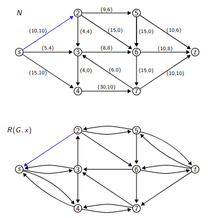
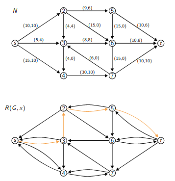
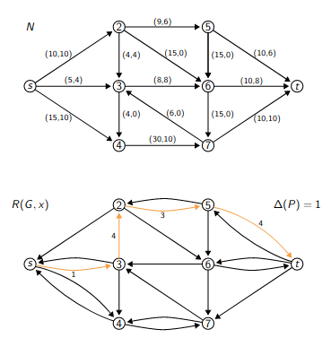

# Flujos Marenquianos

Que es flujo? Algo raro? Si

| Notación          | Significado                                                  |
| ----------------- | ------------------------------------------------------------ |
| $G = (V, E)$, $N$ | Dígrafo                                                      |
| $x$               | flujo de un digrafo $G$                                      |
| $x_{ij}$          | Valor del flujo en la arista ij                              |
| $F$               | valor de un flujo $x$                                        |
| $S$               | Un corte de G                                                |
| $\bar{S}$         | Los nodos de G que no forman parte de S                      |
| $u(ij)$           | La capacidad de la arista ij                                 |
| $U(S)$            | La capacidad de un corte $S$                                 |
| $s, t$            | Donde empieza(Source) y donde termina(Target(o Tfinish si sos :sunglasses:)) la red. |

# Flujo Maximo

Dado una red (digrafo) $G = (V,E)$, unos nodos de origen y destino $s, t \in V$ de origen y destino; y una función de capacidad $u: E \rarr \mathbb{Z}_+$ asociada con los edges.

Un flujo es una funcion $x : E \rarr \mathbb{Z}_+$ y cumple:

1. **Conservación del flujo:** para cada nodo, la cantidad de flujo que entra es igual a la cantidad de flujo que sale. 
2. **No sobrecargar los arcos**: para cada edge el flujo enviado tiene que ser menor al de la función de capacidad $u$ $\implies x_{ij} \leq u_{ij}$
3. **El valor de flujo ($F$) es el flujo neto de s**.


### Problema:

Maximizar el valor del flujo para una red dada.

### Observación (Teórica):

Para todo flujo válido $x$ existe otro flujo donde no entra nada a $s$ y no sale nada de $t$.

------

## Corte:

Un corte ($S$) en la red $G$, es un subconjunto de nodos, que no contiene a **t** y si contiene a **s**.

**Proposición:**
$F= \sum_{ij \in S\bar{S}}x_{ij} - \sum_{ij \in \bar{S}S}x_{ij}$ donde $\bar{S} = V\ \setminus S$


### Capacidad de Corte:

Se define para un corte S como:

$u(S) = \sum_{ij \in S\bar{S}}u_{ij}$

Es la suma de la capacidad todas las aristas salientes del corte. 

Podemos acortar el valor del flujo $x$ = $F$ de cualquier grafo con la capacidad de cualquier corte:
$(\forall S) (F \leq u(S))$. 

Esto significa que si yo encuentro un flujo $x$ que tenga valor $F$ tal que  $F = u(S)$ entonces $x$ es un flujo maximo, para cualquier S.

### Teorema (max flow-min cut):

Dada una red $N$, el valor del flujo máximo es igual a la capacidad del corte mínimo.


## Camino de Aumento

### Red Residual:

Dada una red $G = (V,E)$ con función de capacidad $u$ y un flujo factible $x$, definimos la red residual $R(G, x) = (V,A_R)$ donde

1. $ij \in A_R \text{ si } x_{ij} < u_{ij}$ Pongo los arcos que no estan saturados
2. $ji \in A_R \text{ si } x_{ij} > 0$ Si tengo flujo en una arista, agrego el arco opuesto.




### Camino de aumento

Un **camino de aumento** es un camino orientado de s a t en $R(G, x)$.




Dado un camino de aumento $P$, para cada arco $ij \in P$ definimos:
$$
\Delta(ij) =
\begin{cases}
    u_{ij} - x_{ij} &\text{ si } ij \in A \text{}\\
    x_{ji} &\text{ si } ji \in A
\end{cases}
$$
A su vez podemos ver cuanto es el máximo flujo que podemos agregar para un determinado camino de aumento $P$. Esto es equivalente a encontrar nuestro cuello de botella en el camino de aumento. Por eso definimos $\Delta(P) = min_{ij\in P}(\Delta(ij))$.




Usamos $P$ y $\Delta(P)$, para modificar el flujo original.
$$
\bar{x}(ij)
\begin{cases}
    x_{ij} &\text{ si ij } \notin P \\
    x_{ij} + \Delta(P) &\text{ si ij } \in P\\
    x_{ij} - \Delta(P) &\text{ si ji } \in P
\end{cases}
$$


```mermaid
flowchart LR
	subgraph x:
	direction LR
	s((s));	2((2)); 3((3));	4((4)); 5((5)) ;6((6)) ;7((7)); t((t))
	s -->|"(10,10)"| 2 
	
	
	s --> 3
	2 --> 3
	7 --> 3

	s --> 4
	3 --> 4
	
	2 --> 5
	
	2 --> 6
	3 --> 6
	5 --> 6
	
	4 --> 7
	
	5 & 6 & 7 --> t
	

	
	end
```


Y $\bar{x}$ es un flujo factible con valor $\bar{F} = F + \Delta(P)$.


### **Teorema**:

 No existe camino de aumento $\iff$ $x$ es de flujo máximo


## Algoritmo de Ford y Fulkerson

Obtiene un flujo con capacidad maxima con complejidad $O(nmU)$, donde $U = max_{ij \in A}u_{ij}$ (Arista de capacidad máxima)

```
Definir un flujo inicial en N (por ejemplo x = 0)
mientras exista P := camino de aumento en R(G , x) hacer
    para cada arco ij ∈ P hacer
        si ij ∈ A entonces
            xij := xij + ∆(P)
        si no (ji ∈ A)
            xji := xji − ∆(P)
        fin si
    fin para
fin mientras
```

**Teorema:** Si las capacidades de los arcos de la red son enteros, el valor del flujo máximo va a ser entero.

**Teorema:** Si los valores del flujo incial y las capacidades de los arcos de la red son enteras, entonces el metodo de Fulkerson realiza a lo sumo $nU$ iteraciones, donde $U$ es una cota superior finita para el valor de las capacidades.

Si las capacidades o el flujo inicial son irracionales, el metodo de Fulkerson puede no parar.


## Modificación de Edmonds y Karp al algoritmo de Ford y Fulkerson

Ahora para buscar caminos de aumento, usamos BFS para encontrarlos. Convierte la complejidad en $O(nm^2)$.[^demo]

[^demo]: No trivial, dijo que después subía la demo. No van a estar aca


# Matching máximo en grafos bipartitos

Un matching máximo o correspondencia entre los vértices de $G$, es un conjunto $M \subseteq E$ de aristas de $G$ tal que para todo $v \in V$, v es incidente a lo sumo a una arista de M. Es un conjunto de aristas que no comparten vertices entre si.

El problema es encontrar el matching que tenga el cardinal maximo.

Podemos modelar el problema de matching máximo en grafos bipartitos como un problema de flujo.

TODO: Agregar un ejemplito.


# Flujo de Costo Mínimo

## Definición:

Es una generalización del problema de encontrar flujos.

**Datos de entrada:**

1. Un grafo dirigido $G=(V,E)$
2.  Imbalance $b: V \rarr \mathbb{Z}$ Inyecta o saca flujo a la red. Si es positivo agrega flujo a la red, si es negativo saca de la red, y si es 0 
3. Capacidad $u: E \rarr \mathbb{Z}$ La capacidad de cada arco o arista
4. Costo unitario $c:E \rarr \mathbb{Z}$ El costo de enviar una unidad por esa arista

**Problema:** Encontrar un flujo $x$ que respete el imbalance de cada nodo y las cotas de cada arco, con el menor costo posible.

1. El imbalance se debe cumplir: $b_i = \sum_{j \in N^{IN}(i)}x_{ij} - \sum_{j \in N^{OUT}(i)}x_{ji}$
2. No hay que pasarse de la capacidad: $0 \leq x_{ij} \leq u_{ij}$
3. El costo del flujo es $C = \sum_{ij \in E}c_{ij}x_{ij}$

**Suposiciones:**

1. Los datos son enteros
2. Los imbalances balancean $\sum_{i \in N}b_i = 0$. (Si no no hay solución posible)


**Caso especial: circulación** Si todos los nodos tienen imbalance 0, el flujo se llama una circulación. Toda circulación puede descomponerse en un conjunto de ciclos simples.

(Materia: Investigacion Operativa(paula zabala) -> Como modela )


## Red Residual:

Red residual $G_x$ del flujo $x$ reemplazando cada arco $ij \in A$ por dos arcos $ij$ y $ji$ cumpliendo:

1. El arco $ij$ tien costo $c_{ij}$ y capacidad residual $r_{ij} = u_{ij} - x_{ij}$
2. El arco $ji$ tiene costo $-c_{ij}$ y capacidad residual $r_{ji} = x_{ij}$

La red residual consiste solamente de los arcos con capacidad residual positiva.

**Teorema:** Si todos los imbalances y capacidades son enteros entonces el problema de flujo de costo minimo tiene una solución óptima entera.

==**Teorema:**== Una solución factible $x$ es optima si y solo si la red residual $G_x$ no contiene ningún ciclo dirigido de costo negativo.
Demostración:

------

==Lema:== (Demo no terminada)(TODO fijarse si las sube?)
Si $x$ y $x*$ son soluciones factibles, enconteces $x= x^* + \bar{x}$, donde $\bar{x}$ es un circulación en $G_{x^*}$.
DEMOSTRACION:
$$
\sum_{j \in N^{IN}(i)}x_{ij} - \sum_{j \in N^{OUT}(i)}x_{ji} = b_i\\
\sum_{j \in N^{IN}(i)}x^*_{ij} - \sum_{j \in N^{OUT}(i)}x^*_{ji} = b_i\\


\sum_{j\in N^{IN}(i)}(x_{ij}-x^*_{ij}) - \sum_{j\in N^{OUT}(i)}(x_{ji}-x^*_{ji}) = 0
$$


Si $x_{ij} - x^*_{ij} > 0 \implies x^*_{ij} < x_{ij} \leq u_{ij} \implies x^*_{ij} < u_{ij} \implies ij \in G_{x^*}$
Si $x_{ij} - x^*_{ij} < 0 \implies x^*_{ij} > x_{ij} \geq 0 \implies x^*_{ij} > 0 \implies$

------

Supongamos que $G_{x^*}$ tiene un ciclo de costo negativo y sea $\bar{x}$ una circulación no nula asociada con este ciclo


## Algoritmo de cancelacion de ciclos:

A partir de un flujo factible, podemos obtener flujos de la misma capacidad pero menor costo, hasta que no sea posible. Estas mejoras provienen de enciar flujo por los ciclos negativos del grafo residual de G. En particular si empezamos desde algun flujo maximo, podemos mejorarlo a un flujo maximo de costo minimo.

```
encontrar flujo maximo
Crear la red residual, correr bellman-ford desde t y encontrar un ciclo negativo
Encontrar la capacidad maxima de ese ciclo
Subir/Bajar el flujo de esas aristas por la cantidad encontrada
```

### Complejidad:

Costo por iteración: $O(m*n)$ de Bellman-Ford 
Cantidad de Iteraciones: $O(mCU)$ donde $C$ es el costo maximo de una arista, y $U$ la capacidad maxima de una arista

$\implies O(nm^2CU)$

Se puede mejorar un poco esta complejidad si en vez de tomar cualquier ciclo se toma el ciclo de minimo costo promedio[^costo promedio], el costo baja a $O(\min\{nm\lg(nC),\ nm^2\lg(n)\})$

[^costo promedio]: para un ciclo $W$, el costo promedio $\bar{C}(W)$ es $\sum_{v \rarr w \in W}c(v \rarr w)/|W|$

## Algoritmo Succesive Shortest Paths

Construyo el flujo usando los caminos de aumentos de la red Residual pero siempre eligiendo el camino de menor costo. Si empezamos siempre desde el flujo 0 esto nos asegura que siempre estamos agregando la unidad de flujo más barata.

### Complejidad:

Cantidad de iteraciones: $O(nU)$
Costo por iteración: $O(mn)$ (Bellman-Ford)

Costo Total: $O(mn^2U)$

Esto se puede mejorar, se puede modificar para usar a Dijkstra en vez de Bellman-Ford. Tambien se puede bajar la cantidad de iteraciones a $O(m\lg(U))$(las diapos de las practicas estaban poco claras). Y nos deja con una complejidad total de $O(m\lg(U)*\min\{n^2,m\lg(n)\})$